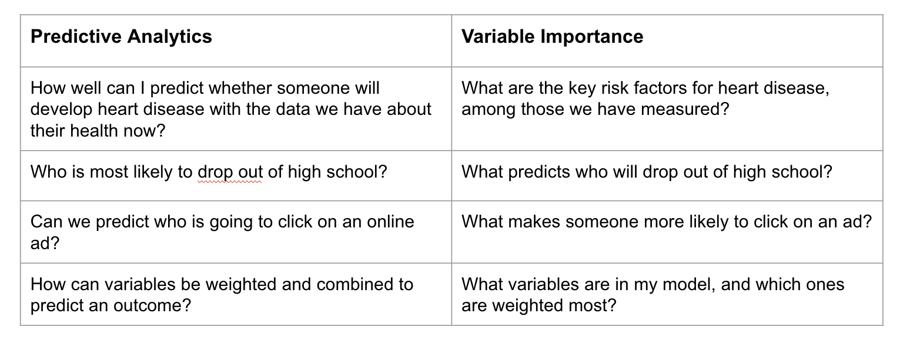
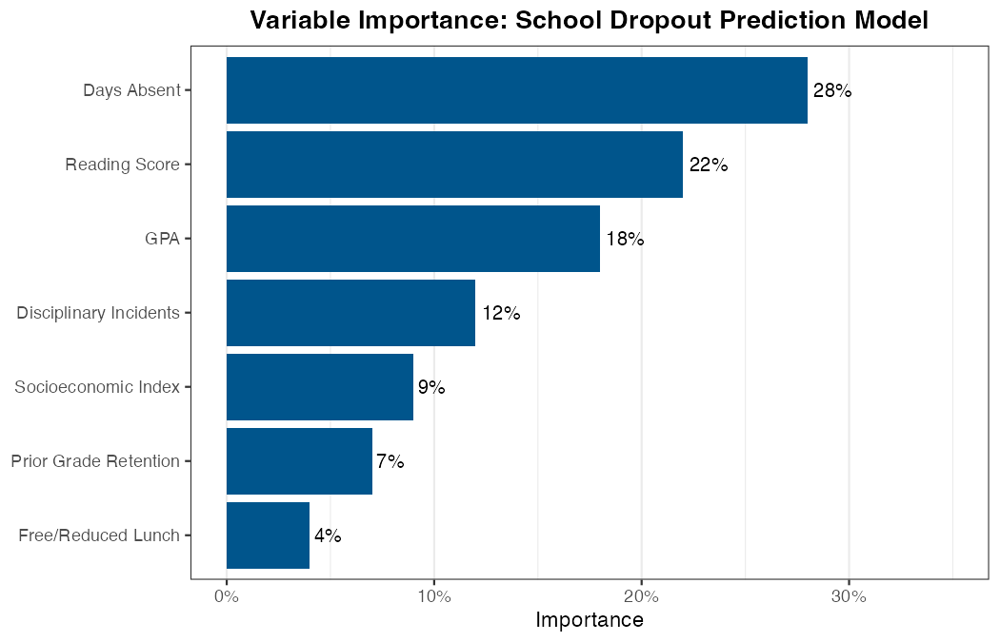

Understanding which predictors matter most in your model serves two
closely related purposes:

-   **Understanding your model**: Which features is the model relying on
    most heavily? Does this align with what domain experts would expect?
-   **Communicating results**: Stakeholders will often want to know
    *why* the model flags certain individuals as high-risk. Variable
    importance (VI) provides a way to answer that question.

VI results can also serve as a model check. If the most important
predictor turns out to be something unexpected --- or something you know
to be a flawed measure --- that is worth investigating before
deployment.

### The value of variable importance

The following chart illustrates how VI relates to --- but differs from
--- predictive analytics more broadly:

{fig-align="center" width="8in"}

Predictive analytics asks: *How well can we predict who will experience
the outcome?* Variable importance asks: *Which features does the model
use most heavily to generate those predictions?* These are related but
distinct questions. Importantly, VI does not tell you what *causes* the
outcome --- only what the model has learned to use as signals in your
data.

### Variable importance methods

There are many methods for estimating VI. Two distinctions are worth
understanding before choosing an approach.

**Model-specific vs. model-agnostic**

-   *Model-specific* methods are built into a particular modeling
    approach and can only be applied to that model type.
-   *Model-agnostic* methods can be applied to any model, making them
    more flexible --- especially useful when comparing multiple
    learners.

**Global vs. local**

-   *Global* VI methods summarize which predictors matter most across
    all predictions --- useful for explaining the overall model to an
    audience.
-   *Local* VI methods explain a single individual's prediction ---
    useful when a caseworker or program staff member wants to understand
    why a specific person was flagged as high-risk.

#### Model-specific methods

Each modeling approach has its own native VI measure. A few examples:

-   **Logistic regression**: VI is typically assessed based on the size
    and statistical significance of coefficients. Larger absolute
    coefficients indicate stronger associations with the outcome, though
    direct comparisons across variables on different scales can be
    misleading, and multicollinearity can complicate interpretation.
-   **Tree-based models (decision trees, random forests, XGBoost)**: VI
    is often measured by how much each feature reduces impurity (e.g.,
    Gini importance) across splits. These methods can spread importance
    across many correlated features, so results should be interpreted
    with care.

Model-specific methods are convenient but have limitations: they may
not translate well across model types, and their behavior with
correlated predictors varies.

#### Model-agnostic methods

**Permutation importance**

Permutation-based VI measures how much model performance drops when a
single feature's values are randomly shuffled --- breaking its
relationship with the outcome. A large drop signals that the feature is
important; a small drop suggests the model performs nearly as well
without it. This method works with any modeling approach and can be
applied to individual variables or groups of related variables.

**SHAP (SHapley Additive exPlanations)**

SHAP asks: *How much does each feature contribute to moving a specific
prediction away from the model's average prediction?*

SHAP can be used in two ways:

-   **Globally**: Averaging SHAP values across all predictions to
    summarize which features drive the model overall.
-   **Locally**: Examining SHAP values for a single individual to
    explain why they received a particular predicted probability.

The global view might show that absenteeism is the strongest overall
driver of predictions. The local view might reveal that for one
specific student, a low reading score was the primary factor, even if
absenteeism matters more across the population. This local
interpretability is especially valuable in public services contexts,
where staff may need to understand and explain decisions affecting
specific individuals.

SHAP accounts for interactions and dependencies among features, which
often makes it more accurate than simpler approaches --- though also
more computationally intensive.

### Choosing a VI method

No single VI method is best in all situations. The table below offers
practical guidance:

| Situation | Suggested approach |
|---|---|
| Quick overview during model development | Model-specific VI |
| Comparing VI across multiple learners | Permutation importance |
| Explaining the overall model to stakeholders | SHAP (global) |
| Explaining an individual prediction to program staff | SHAP (local) |

### Communicating VI results

When sharing VI results with stakeholders, a few principles help:

-   **Lead with the "so what."** Don't just present a ranked list of
    features --- explain what the top predictors reveal about who the
    model is flagging and why.
-   **Reinforce the causation caution.** VI shows what the model is
    using as signals, not what causes the outcome. Make this explicit so
    stakeholders do not misinterpret these results as reasons to target
    specific characteristics directly.
-   **Visualize clearly.** A horizontal bar chart ranking features by
    importance is typically the most readable format for non-technical
    audiences.

The plot below shows an example of what VI results might look like for
the school dropout model:

{fig-align="center" width="7in"}

Finally, as optional further reading, this paper demonstrates how PA and
VI can be combined and translated into actionable insights for refining
program services:

<https://www.acf.hhs.gov/sites/default/files/documents/opre/Predicting-HMRF-Participation-Brief.pdf>
