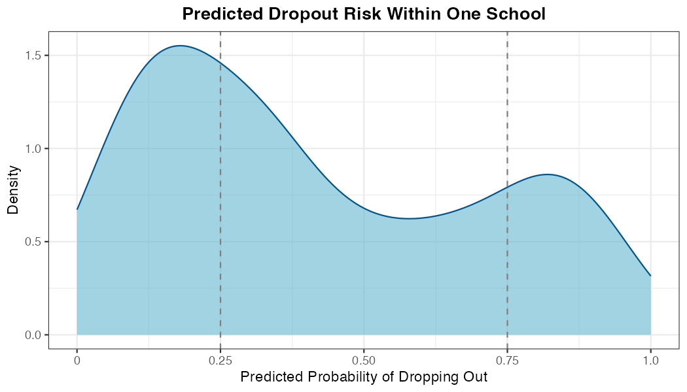
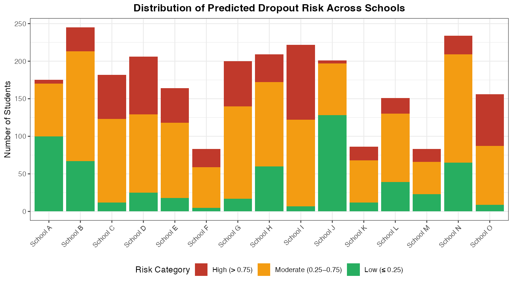

After generating predicted probabilities for your test data, one of the
first valuable steps is to examine how those probabilities are
distributed --- both within individual sites (like schools, clinics, or
program locations) and across sites. This helps answer questions that
stakeholders will inevitably ask:

-   Is the population mostly low-risk, mostly high-risk, or mixed?
-   Are some sites much higher-risk than others?
-   Where might interventions or resources be most needed?

Understanding these patterns is also essential for communicating your
results clearly. Visualizations of predicted probability distributions
can make complex model output accessible to non-technical audiences.

## Distribution within a single group

The plot below shows how predicted probabilities of dropping out of high
school are distributed within a single school. Each student has one
predicted probability between 0 and 1; the density curve shows how
those values are spread across that range.

{fig-align="center" width="7in"}

In this school, a few patterns stand out:

-   Many students cluster at **low predicted risk** (below 0.25) ---
    they are unlikely to drop out.
-   A smaller group has **high predicted risk** (above 0.75) --- these
    are the students the model flags as most in need of attention.
-   A notable share falls **near 0.5**, where the model is most
    uncertain about their outcome.

When communicating this plot to stakeholders, walk them through what the
x-axis represents and highlight any notable clusters. It is worth
addressing what a value near 0.5 means: not that a student will
definitely drop out, but that the model is uncertain --- which itself
may be useful information for targeting follow-up.

## Distribution across groups

The next plot extends this view across many schools at once, making it
easy to compare sites.

{fig-align="center" width="8in"}

For each school, students are grouped into three predicted risk
categories:

-   **Low risk**: predicted probability ≤ 0.25
-   **Moderate risk**: predicted probability \> 0.25 and ≤ 0.75
-   **High risk**: predicted probability \> 0.75

This view quickly reveals which schools have the largest concentrations
of high-risk students --- and which schools are larger or smaller
overall. For stakeholders responsible for allocating support across
sites, this kind of visualization is especially useful for deciding
where to focus first.

When presenting this plot, be ready to explain the thresholds used
(0.25 and 0.75) --- stakeholders will want to know how those cutoffs
were chosen and what they imply for decisions. Threshold selection is
covered in more detail in the [Selecting a
threshold](perform_selectthreshold.qmd) section.
