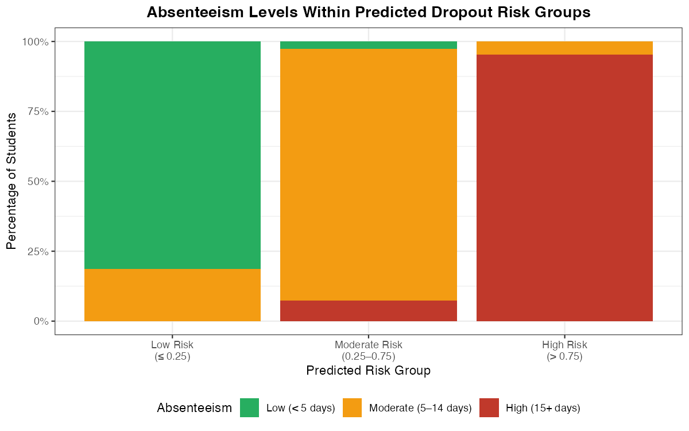

The previous page asked how predicted probabilities are distributed
within and across groups. This page flips the question: instead of
looking at *where* probabilities fall, we look at *who* ends up with
low or high predicted probabilities.

In other words --- what do high-risk individuals tend to have in common?
And how does that differ from low-risk individuals?

This kind of analysis is valuable for two reasons:

-   **Program design**: If high-risk students share certain
    characteristics --- like high absenteeism or low reading scores ---
    this can point toward what kinds of interventions might help them
    most.
-   **Communication**: Showing stakeholders *who* is flagged as
    high-risk makes abstract predicted probabilities more concrete and
    interpretable.

## Looking at characteristics within risk groups

One useful approach is to examine how individual characteristics are
distributed across risk groups. The plot below illustrates this for the
school dropout example, showing how absenteeism levels vary among
students in each predicted risk category.

{fig-align="center" width="8in"}

Students with high predicted dropout risk have much higher rates of
absenteeism compared to low-risk students. Patterns like this help
program staff understand who is being flagged and why --- and can point
toward areas for intervention design.

**An important caution:** Finding that a characteristic is common among
high-risk students does not mean that characteristic *causes* the
outcome. Absenteeism may be strongly associated with dropout risk, but
many factors contribute to a student's situation, and correlation is not
causation. This distinction matters when communicating findings to
stakeholders, who may be tempted to treat these patterns as direct
levers to pull. Frame your results carefully: these are associations
observed in your data, not causal claims.

## Considering multiple characteristics at once

The approach above works well for examining one characteristic at a
time. When you want to explore several characteristics simultaneously,
additional visualization strategies --- such as mosaic plots or faceted
bar charts --- can help surface more complex patterns. The key is to
choose a visualization that your audience can read intuitively, and to
guide them through what they are seeing rather than leaving the chart to
speak for itself.

When communicating these results, focus on patterns that are most
actionable for the program. Highlight where high-risk students are
concentrated, and use the findings to prompt productive questions about
program design --- not to make deterministic claims about any individual
student.
